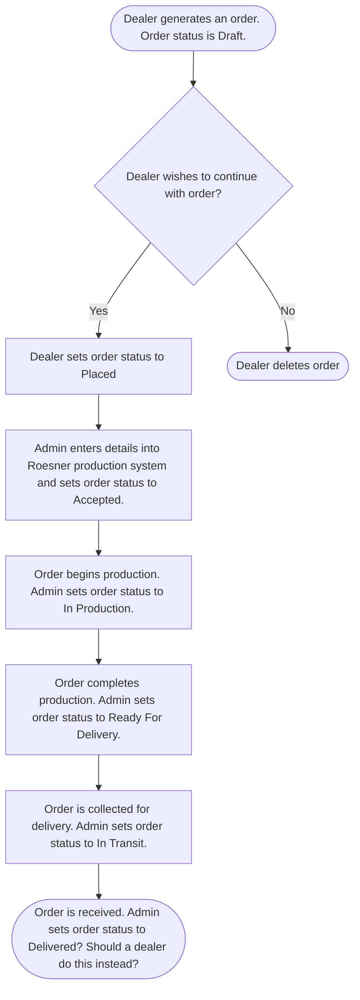
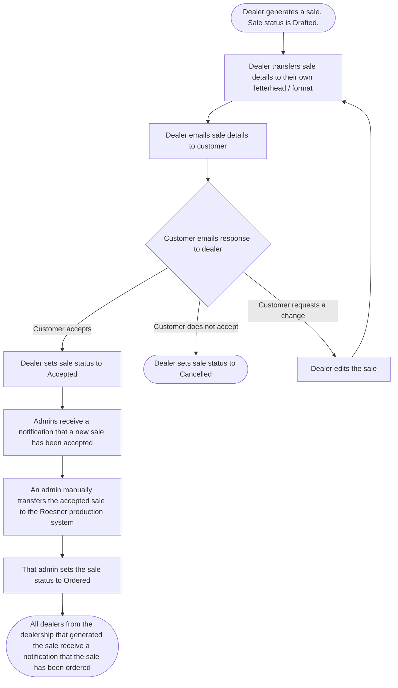
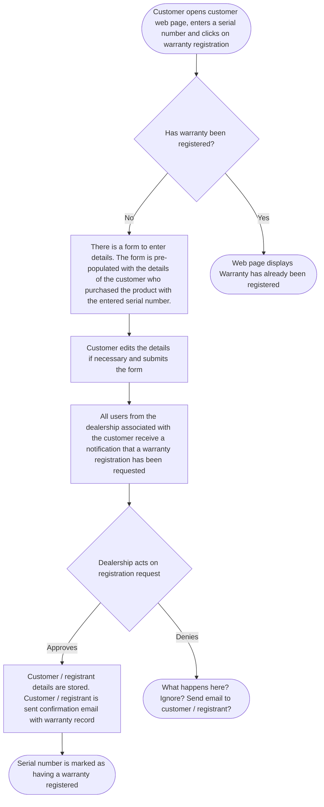

# Roesner Dealer Portal - Software Requirements Specification

Version: 0.4  
Date: 26/03/2026   
Issued By: Daniel Niven-Hulett

# Table of Contents

- [Overview](#overview)
    - [Purpose](#purpose)
    - [UI](#ui)
    - [Technical](#technical)
- [User](#user)
    - [User - Data](#user---data)
    - [User - Operations](#user---operations)
    - [Password](#password)
- [Notifications](#notifications)
- [Dealership](#dealership)
    - [Dealership - Data](#dealership---data)
    - [Dealership - Operations](#dealership---operations)
- [Branch](#branch)
    - [Branch - Data](#branch---data)
    - [Branch - Operations](#branch---operations)
- [Customer](#customer)
    - [Customer - Data](#customer---data)
    - [Customer - Operations](#customer---operations)
- [Machine](#machine)
    - [Machine - Data](#machine---data)
    - [Machine - Operations](#machine---operations)
- [Option](#option)
    - [Option - Data](#option---data)
    - [Option - Operations](#option---operations)
- [Machine-Option Relationship](#machine-option-relationship)
    - [Machine-Option Relationship - Operations](#machine-option-relationship---operations)
- [Order](#order)
    - [Order - Data](#order---data)
    - [Order - Status](#order---status)
    - [Order - Workflow](#order---workflow)
    - [Order - Operations](#order---operations)
    - [Order - Notifications](#order---notifications)
- [Sale](#sale)
    - [Sale - Data](#sale---data)
    - [Sale - Status](#sale---status)
    - [Sale - Workflow](#sale---workflow)
    - [Sale - Operations](#sale---operations)
    - [Sale - UI](#sale---ui)
- [Dealer Training and Resources](#dealer-training-and-resources)
    - [Blog](#blog)
    - [Blog - Operations](#blog---operations)
- [Customer Web Page](#customer-web-page)
    - [Warranty Workflow](#warranty-workflow)
- [Brochure](#brochure)
- [Requires Further Discussion](#requires-further-discussion)

# Overview

## Purpose

The goals of this project are as follows:
1. Build a web app that provides tools and information for Roesner dealers. The web app is intended to be used by Roesner employees and Roesner dealers. It is not intended to be used by customers or the general public. The most prominent tools provided by the web app include:
    - Generating and managing quotes for Roesner products
    - Managing warranties
    - Providing training material and product information
2. Provide a public facing web page where customers are able to input a product serial number and are then served documentation corresponding to that serial number. These documents include:
    - Warranty information
    - Product manuals
    - Parts catalogues

## UI

- Basic dashboard / portal style app 
- Must be usable on desktop and mobile (responsive design)

## Technical

- Nodejs backend
- Any simple HTML templating engine for frontend is sufficient (*e.g.* ejs, pug, *etc.*). Prefer this over separate frontend framework (*e.g.* React, Angular, *etc.*) due to simplicity.
- SQL database
- Bootstrap for css styling
- Database "deletes" should be soft / recoverable *i.e.* more like an archive

# Authorisation

There are three levels of authorisation as described in the table below. These determine levels of access to various tools and features within the app. Details on how authorisation affects access to features in the app are described in further sections of this document.

| Authorisation Level | Description |
|---|---|
| Admin | <ul><li>Highest level of authorization</li><li>Full access to all features</li><li>Intended for Roesner staff</li></ul>  |
| Dealer Admin | <ul><li>Middle level of authorization</li><li>Restricted access to features</li><li>Intended for dealership managers</li></ul>  |
| Dealer | <ul><li>Lowest level of authorization</li><li>Restricted access to features</li><li>Intended for dealer staff</li></ul>  |

# User

A user refers to a person who has access to the Roesner Dealer Portal. This is either a staff member of Roesners or a staff member of a Roesner dealership.

## User - Data

All fields are compulsory unless otherwise stated
| Field | Notes |
|---|---|
| First Name |  |
| Last Name |  |
| Email | Should be insensitive to case (*e.g.* `AAA@mail.com` and `aaa@mail.com` should be treated as the same email address). |
| Password | Appropriate security measures should be taken when storing password. |
| Authorisation | Dictates what features are available to the user. |
| Dealership | What dealership does the user belong to. Dictates what data is viewable by the user. |
| Branch |  |

## User - Operations

| | Admin | Dealer Admin | Dealer |
| --- | :---: | :---: | :---: |
| Can create a new user with admin level authorisation | ✓ | x | x |
| Can create a new user with dealer admin level authorisation | ✓ 1 | ✓ 2 | x |
| Can create a new user with dealer level authorisation | ✓ 1 | ✓ 2 | x |
| Can edit their own details 3 | ✓ | ✓ | ✓ |
| Can edit the details of another user with admin level authorisation | ✓ | x | x |
| Can edit the details of another user with dealer admin level authorisation | ✓ 1 | ✓ 2 | x |
| Can edit the details of another user with dealer level authorisation | ✓ 1 | ✓ 2 | x |
| Can archive their own account | x | x | x |
| Can archive another user with admin level authorisation | ✓ | x | x |
| Can archive another user with dealer admin level authorisation | ✓ 1 | ✓ 2 | x |
| Can archive another user with dealer level authorisation | ✓ 1 | ✓ 2 | x |
| Can view other users | ✓ 1, 4 | ✓ 2 | ✓ 2 |

(1) For any dealership  
(2) For the same dealership as that user  
(3) Excluding authorisation level  
(4) Can filter by dealership and user name

## Password
- When a new user is created, an email is automatically sent to the new users email address. This email contains a link. Following this link takes the user to a webpage where they can set their password.
- All users can reset their own password. There is a link on the login page to reset password.

# Notifications

- Users may receive notifications / emails based on certain events (*e.g.* a
sale being accepted)
- Users can toggle which notifications they receive

# Dealership

A dealership refers to a company that is authorised to sell Roesner products. 

## Dealership - Data

All fields are compulsory unless otherwise stated
| Field | Notes |
|---|---|
| Name |  |
| Logo | <ul><li>Optional</li></ul> |

## Dealership - Operations

| | Admin | Dealer Admin | Dealer |
| --- | :---: | :---: | :---: |
| Can create a new dealership | ✓ | x | x |
| Can edit a dealership | ✓ | ✓ 1 | x |
| Can archive a dealership | ✓ | x | x |
| Can view dealerships | ✓ | x | x |

(1) Only the dealership to which that user belongs

# Branch

A branch refers to the physical location of a dealership. A dealership may have one or multiple branches. These branches are all the same company / dealership, however they are present in multiple separate physical locations.

## Branch - Data

All fields are compulsory unless otherwise stated
| Field | Notes |
|---|---|
| Dealership |  |
| Name |  |
| Street Address |  |
| City |  |
| State |  |
| Post Code |  |

## Branch - Operations

| | Admin | Dealer Admin | Dealer |
| --- | :---: | :---: | :---: |
| Can create a new branch | ✓ 1 | ✓ 2 | x |
| Can edit a branch | ✓ 1 | ✓ 2 | x |
| Can archive a branch | ✓ 1 | ✓ 2 | x |
| Can view branches | ✓ 1 | ✓ 2 | ✓ 2 |

(1) For any dealership  
(2) For the same dealership as that user  

# Customer

A customer refers to a person who either enquires about or buys Roesner products from a dealership.

## Customer - Data

All fields are compulsory unless otherwise stated
| Field | Notes |
|---|---|
| Company Name | Optional |
| First Name |  |
| Last Name |  |
| Email | Should be insensitive to case (*e.g.* `AAA@mail.com` and `aaa@mail.com` should be treated as the same email address) |
| Phone Number |  |
| Street Address |  |
| City |  |
| State |  |
| Post Code |  |
| Dealership | Don't want dealers from one dealership to be able to access customer details from another dealership. Hence customer details should be tied to a dealership. |

## Customer - Operations

|  | Admin | Dealer Admin | Dealer |
| --- | :---: | :---: | :---: |
| Can create a new customer | ✓ 1 | ✓ 2 | ✓ 2 |
| Can edit a customer | ✓ 1 | ✓ 2 | ✓ 2 |
| Can archive a customer | ✓ 1 | ✓ 2 | ✓ 2 |
| Can view customers | ✓ 1, 3, 4 | ✓ 2, 3 | ✓ 2, 3 |

(1) For any dealership  
(2) For the dealership that the user belongs to  
(3) Can filter by name  
(4) Can filter by dealership  

# Machine

A "machine" refers to a primary product sold by Roesners. Currently this is only referring to an agricultural spreader. At present, this is the only primary product offered by Roesners. However the term "machine" is used here instead of "spreader" to allow for a future where Roesners offer primary products other than agricultural spreaders (*e.g.* agricultural rippers). 

## Machine - Data

All fields are compulsory unless otherwise stated.
| Field | Notes |
|---|---|
| Name |  |
| Price |  |

## Machine - Operations

|  | Admin | Dealer Admin | Dealer |
| --- | :---: | :---: | :---: |
| Can create a new machine | ✓ | x | x |
| Can edit a machine | ✓ | x | x |
| Can archive a machine | ✓ | x | x |
| Can view machines | ✓ | ✓ | ✓ |

# Option

A machine option can refer to either an optional extra piece of equipment for a machine (*e.g.* a camera kit) or an optional extra alteration to a machine (*e.g.* 3 metre track width).

## Option - Data

All fields are compulsory unless otherwise stated.
| Field | Notes |
|---|---|
| Name |  |
| Price |  |

## Option - Operations

|  | Admin | Dealer Admin | Dealer |
| --- | :---: | :---: | :---: |
| Can create a new machine option | ✓ | x | x |
| Can edit a machine option | ✓ | x | x |
| Can archive a machine option | ✓ | x | x |
| Can view machines options | ✓ | ✓ | ✓ |

# Machine-Option Relationship

Not all options are compatible with all machines. A machine-option relationship indicates that a particular option is compatible with a particular machine.

## Machine-Option Relationship - Operations

|  | Admin | Dealer Admin | Dealer |
| --- | :---: | :---: | :---: |
| Can create a new machine-option relationship | ✓ | x | x |
| Can edit a machine-option relationship | ✓ | x | x |
| Can archive a machine-option relationship | ✓ | x | x |
| Can view machine-option relationships | ✓ | ✓ | ✓ |

# Order

An "order" refers to the details of a purchase of a Roesner machine and options by a dealership. This is strictly a transaction between a dealership and Roesner's. This not a transaction between a customer and a dealership. A dealership may order a machine from Roesner's at the price defined by Roesner's and then later quote and sell that machine to a customer at a different price (*e.g.* adding an extra margin on top or selling at a discount and taking a loss).

## Order - Data

All fields are compulsory unless otherwise stated.
| Field | Notes |
|---|---|
| Machine | <ul><li>An order must contain exactly one machine</li></ul> |
| Options | <ul><li>Optional</li><li>May be zero, one or multiple options</li><li>An option must be compatible with the machine as dictated by the machine-option relationships</li></ul> |
| Total Price | <ul><li>Total price should be a separate value calculated as the sum of the price of the machine and options</li><li>If the price of a machine or option is edited in the future, it should not retroactively affect the value of orders generated in the past</li></ul> |
| Order Status |  |
| Customer | <ul><li>Optional</li><li>If there is no customer, this will be a "stock" machine</li><li>If there is a customer, this includes all of that customers details (*i.e.* name, address, *etc.*)</li></ul> |
| Dealership |  |
| Branch |  |
| Order Status Update Log | <ul><li>Each time the status of an order is updated, this should be recorded</li><li>This includes the order being created for the first time (*i.e.* status updated from nothing to Draft)</li><li>Each record should include a what the order status was previously, what the the order status was changed to, a timestamp and the user that updated the order status</li></ul> |

## Order - Status

An order status can be set to one of the statuses below.

| Status | Description |
|---|---|
| Draft | The order has been created, but may require further edits |
| Placed | The order has been finalised and has been submitted to Roesner's |
| Ordered | Order has been accepted by Roesner's and order details have been entered into the Roesner production system |
| In Production | Order has begun production |
| Ready For Delivery | Order has finished production and is awaiting delivery |
| In Transit | Order is currently in transit to the dealership / branch |
| Delivered | Order has been delivered to the dealership / branch |

## Order - Workflow

## Order - Operations

|  | Admin | Dealer Admin | Dealer |
| --- | :---: | :---: | :---: |
| Can create a new order | ✓ | ✓ | ✓ |
| Can edit order details while in Draft status | ✓ | ✓ | ✓ |
| Can edit order details while in status other than Draft | x | x | x |
| Can update order status from Drafted to Placed | ✓ | ✓ | ✓ |
| Can update order status from Placed to Accepted | ✓ | x | x |
| Can update order status from Accepted to In Production | ✓ | x | x |
| Can update order status from In Production to Ready For Delivery | ✓ | x | x |
| Can update order status from Ready For Delivery to In Transit | ✓ | x | x |
| Can update order status from Ready For In Transit to Delivered | ✓ | x | x |
| Can archive an order while in Draft status | ✓ | ✓ | ✓ |
| Can archive an order while in status other than Draft | x | x | x |
| Can view orders | ✓ 1, 3, 4 | ✓ 2, 3 | ✓ 2, 3 |

(1) For any dealership  
(2) For the dealership that the user belongs to  
(3) Can filter by time created and status  
(4) Can filter by dealership

## Order - Notifications

- all admins receive a notification when order status is updated to Placed

# Sale

An "sale" refers to the details of a proposed purchase of a Roesner machine and options by a customer from a dealership. This is not a transaction between a dealership and a Roesner's. A dealership may sell a machine to a customer at a different price to what the dealership paid for it (*e.g.* adding an extra margin on top or selling at a discount and taking a loss). They may also add extra charges (*e.g.* for delivery). A "sale" might be proposed to but not accepted by a customer (*e.g.* a machine is offered to a customer at a given price, but the customer does not accept the offer). This information is still important to track. Thus a "sale" is not necessarily a confirmed transaction, but simply the details around a proposed transaction that may or may not occuer / have occured.

## Sale - Data

All fields are compulsory unless otherwise stated.
| Field | Notes |
|---|---|
| Machine | <ul><li>A sale must contain exactly one machine</li></ul> |
| Options | <ul><li>Optional</li><li>May be zero, one or multiple options</li><li>An option must be compatible with the machine as dictated by the machine-option relationships</li></ul> |
| Price of pre-delivery |  |
| Price of delivery |  |
| General Discount | <ul><li>Optional</li><li>May be zero or one general discount applied to a sale</li><li>This may be either a percentage of the price or a fixed amount</li><li>If a percentage, it is applied to the sum of the machine and option prices (does not include disount for trade-in, price of pre-delivery or price of delivery)</li><li>There are not discounts on a per product basis</li></ul> |
| Trade-in Discount | <ul><li>Optional</li><li>If included, should be a fixed amount (*i.e.* not a percentage)</li></ul> |
| Total Price | <ul><li>Total price should be a separate value calculated as the sum of the price of the machine, options, pre-delivery and delivery minus the sum of the value of the discounts at the time the sale is created</li><li>If the price of a machine or option is edited in the future, it should not retroactively affect the value of sales generated in the past</li></ul> |
| Sale Status |  |
| Customer | <ul><li>This includes all of that customer details (*i.e.* name, address, *etc.*)</li></ul> |
| Dealership |  |
| Sale Status Update Log | <ul><li>Each time the status of a sale is updated, this should be recorded</li><li>This includes the sale being created for the first time (*i.e.* status updated from nothing to Draft)</li><li>Each record should include a what the sale status was previously, what the the sale status was changed to, a timestamp and the user that updated the sale status</li></ul> |

## Sale - Status

A sale status can be set to one of the statuses below.

| Status | Description |
|---|---|
| Drafted | The sale has been created  |
| Cancelled | Customer has declined to proceed with the purchase or the sale was cancelled for some other reason |
| Accepted | Customer has agreed to the purchase |
| Odered | Sale details have been entered into the Roesner production system |

## Sale - Workflow

## Sale - Operations

|  | Admin | Dealer Admin | Dealer |
| --- | :---: | :---: | :---: |
| Can create a new sale | ✓ | ✓ | ✓ |
| Can edit sale details while it is in Drafted status | ✓ | ✓ | ✓ |
| Can edit sale details while it is in Cancelled, Accepted or Ordered status | x | x | x |
| Can update a sale status from Drafted to Cancelled | ✓ | ✓ | ✓ |
| Can update a sale status from Drafted to Accepted | ✓ | ✓ | ✓ |
| Can update a sale status from Accepted to Ordered | ✓ | x | x |
| Can archive a sale | x | x | x |
| Can view quotes | ✓ 1, 3, 4 | ✓ 2, 3 | ✓ 2, 3 |
| Can download sale data as csv | ✓ | x | x |

(1) For any dealership  
(2) For the dealership that the user belongs to  
(3) Can filter by time created, customer and status  
(4) Can filter by dealership

## Sale - Notifications

- all admins receive a notification when sale status is updated to Accepted?

## Sale - UI

### Customer Facing

The quote that the customer receives
- Dealership / branch name, address and contact details are displayed on the sale
- Dealership logo is displayed on the sale if a logo has been provided
- Sale contents are contained in a table
- Table has a column for "Selected", "Name", "Price" and "More Info"
- Machine is listed first
- All selected options (if any) are listed next
- All options that are available for the machine that have not been selected (if any) are listed next
- Pre-delivery, delivery and discounts are listed next
- Total price is listed last
- For any item that has been selected, the "Selected" column should display a signifier (e.g. a tick or dot) to illustrate that the item is selected
- For any item that has not been selected in the sale, the "Selected" column should be left empty
- The "More Info" column contains a link to the relevant section of the brochure web page for each product listed in a sale
- The "More Info" column is left empty for pre-delivery, delivery and discounts
- As an alternative to the "More Info" column, each product could be a link to the relevant section of the brochure web page

### User Facing 

The tool a user interfaces with for building a sale
- Options have a "more info" button next to them that links to the relevant section of the brochure web page

# Dealer Training and Resources

- The purpose of the dealer training and resources section of the web app is to provide dealers with information regarding
Marshall Multispread and i4M products
- Information might be:
    - Sales focused e.g.
        - What are the benefits of variable rate technology?
        - Why choose i4M over competitors?
    - Support focused e.g.
        - How to calibrate a spreader?
        - How to update from type C to type D spinners?
- Should be formatted like a blog
- A blog entry should be able to handle basic formatting (*e.g.* headings, paragraphs *etc.*)
- A blog entry should be able to contain text, images and videos
- The status of whether a blog entry has been viewed by a user should be tracked

## Blog - Operations

|  | Admin | Dealer Admin | Dealer |
| --- | :---: | :---: | :---: |
| Can create a new blog entry | ✓ | x | x |
| Can edit a blog entry | ✓ | x | x |
| Can archive a blog entry | ✓ | x | x |
| Can view blog entries | ✓ | ✓ | ✓ |
| Can view which blogs have been visited | ✓ 1 | ✓ 2 | ✓ 3 |

(1) For any user  
(2) For any user sharing that users dealership  
(3) For themselves

# Customer Web Page
- A public facing page 
- Intended to be used by customers
- No login required
- Input a product serial number and then serve documentation corresponding to that serial number
- Documentation to serve:
    - Warranty information
    - Product manual
    - Parts catalogue

## Warranty Workflow

# Brochure
- purpose is marketing and education for both customers and dealers
- simple static web page
- public facing
- one brochure page for all options
- each entry has an option name, description, photo, list of compatible machines, any other noteworthy information *e.g.* requires certain level of oil flow

# Requires Further Discussion

## General
- Ability to unarchive things and filter by archived or not

## Dashboard
- Do we need a dashboard?
- If so, what are we displaying here?

## User
- Can a user be attached to multiple branches?
- Have the ability to show the password text by the user clicking a button?
    - Is this viewing your own password?
    - Is this an admin being able to view any users password?
    - Do we need this if a user can reset their own password?

## Stock Machines
- Need the ability to transfer stock from one branch to another?

## Parts
- research below for how to handle parts system
    - new holland 
    - case ih parts
- need to be able to handle serial number breaks e.g. before serial number 12000, all machines used a V2 i4m mild steel housing. after serial number 12000, machines instead used a V3 i4M stainless steel housing. so need to see which part is applicable to which serial number
- display factory stock?
- is this available to customers or just dealers?
    - if for customers as well
        - how do we handle payment? need a whole checkout system like shopify? and an account / login system?
        - pricing? different for direct to customer vs for dealer
        - the dealer must use a different system through the portal right? they would pay on their existing account

## Notifications
- Whole thing needs to be fleshed out
- Is there a separate section for notifications?
- Can they be dismissed?
- Should emails be sent too?

## Order
- should admin be able to cancel order after it has been placed?
- should dealer be able to cancel sale after it has been placed but before it has been ordered / added to the production system?
- should there be some extra pop-up like "are you sure you want to place this order? Yes / no"
- should dealers receive a notification for order updates?

## Sale
- Should you be able to set a default value for predelivery per dealership?
- Should you be able to set a default value for delivery per dealership?
- What if someone accidentally sets a sale to accepted? 
    - Do we need a way to cancel?
    - Do we need an extra confirmation step *e.g.* "This will place an order! Are you sure you want to proceed?"

## Blog
- Not sure how best to approach the creation of blog entries?
    - Perhaps users can write in markdown or html or some other
format in a text field, upload images, submit, then the backend
will do some parsing to generate a webpage 
- Make content searchable? 
    - search bar at the top of the page that can
filter articles by keywords
- Have some broad tags to filter by?
    - *e.g.* support, sales, marshall, i4M

## Customer Web Page
- If a manual / document needs to be updated, do we need a portal for an admin to do this or just have someone do it on the backend? I think backend is simpler.

## Warranty
- Can we just automatically register on purchase?
    - Do we need the customer input?
- For registering warranty details, is this a customer or some other entity (*e.g.* a registrant or beneficiary)?
    - The difference being, if this is a customer, editing the details would overwrite the customer details
    - Is this what we want?
    - Are warranty registrants ever different from the customer?
- What happens when a registration is rejected? 
    - Ignore?
    - Email registrant about why?
- For claiming warranty, a customer needs to go through their dealer. Do we need a section in the dealer portal for dealers to submit details which then gets sent to Roesners? Is this just done through email?

## Change of Ownership
- do we need this?
- does the customer email the dealership?
- do we need a speparate section of the web app for a dealer to change ownership details?

## Digital Signatures
- do we need DocuSign or can we just use our own system? (I think our own system will be fine)
- do we need something more than a confirm button? *e.g.* I [enter name] hereby accept this whatever whatever and then a confirm button.
- probably need actual legal advice
- do some research on digital signatures:
    - https://sprintlaw.com.au/articles/digital-signatures-are-they-legally-binding-in-australia/
    - https://www.affinitylawyers.com.au/electronic-signatures-when-is-it-safe-to-sign-electronically/