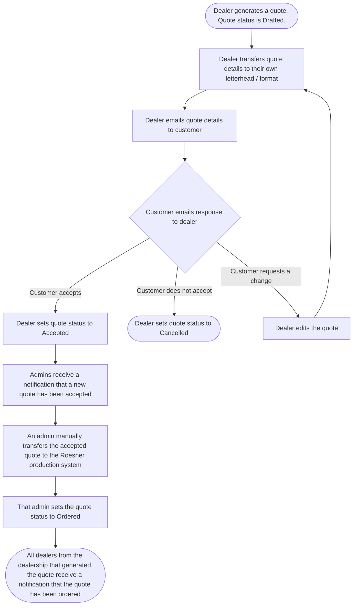
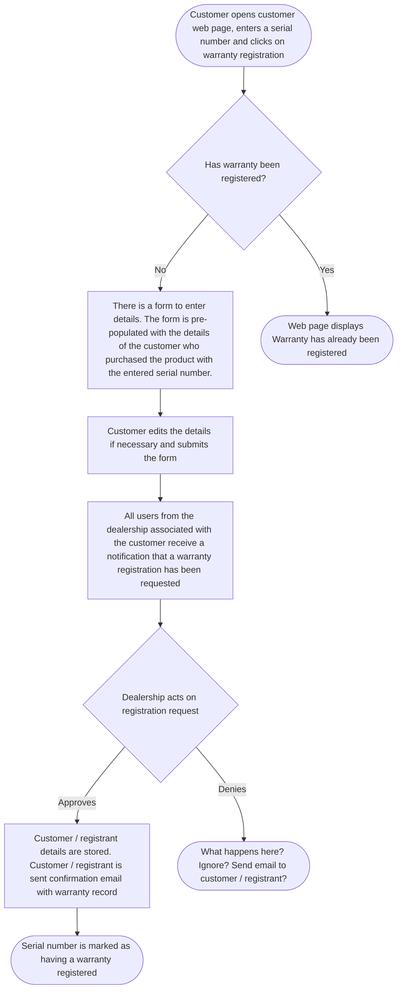

# Roesner Dealer Portal - Software Requirements Specification

Version: 0.3  
Date: 10/03/2026   
Issued By: Daniel Niven-Hulett

# Table of Contents

- [Overview](#overview)
    - [Purpose](#purpose)
    - [UI](#ui)
    - [Technical](#technical)
- [User](#user)
    - [User - Data](#user---data)
    - [User - Operations](#user---operations)
    - [Password](#password)
- [Notifications](#notifications)
- [Dealership](#dealership)
    - [Dealership - Data](#dealership---data)
    - [Dealership - Operations](#dealership---operations)
- [Customer](#customer)
    - [Customer - Data](#customer---data)
    - [Customer - Operations](#customer---operations)
- [Machine](#machine)
    - [Machine - Data](#machine---data)
    - [Machine - Operations](#machine---operations)
- [Option](#option)
    - [Option - Data](#option---data)
    - [Option - Operations](#option---operations)
- [Machine-Option Relationship](#machine-option-relationship)
    - [Machine-Option Relationship - Operations](#machine-option-relationship---operations)
- [Quote](#quote)
    - [Quote - Data](#quote---data)
    - [Quote - Status](#quote---status)
    - [Quote - Workflow](#quote---workflow)
    - [Quote - Operations](#quote---operations)
- [Dealer Training and Resources](#dealer-training-and-resources)
    - [Blog](#blog)
    - [Blog - Operations](#blog---operations)
- [Customer Web Page](#customer-web-page)
    - [Warranty Workflow](#warranty-workflow)
- [Requires Further Discussion](#requires-further-discussion)

# Overview

## Purpose

The goals of this project are as follows:
1. Build a web app that provides tools and information for Roesner dealers. The web app is intended to be used by Roesner employees and Roesner dealers. It is not intended to be used by customers or the general public. The most prominent tools provided by the web app include:
    - Generating and managing quotes for Roesner products
    - Managing warranties
    - Providing training material and product information
2. Provide a public facing web page where customers are able to input a product serial number and are then served documentation corresponding to that serial number. These documents include:
    - Warranty information
    - Product manuals
    - Parts catalogues

## UI

- Basic dashboard / portal style app 
- Must be usable on desktop and mobile (responsive design)

## Technical

- Nodejs backend
- Any simple HTML templating engine for frontend is sufficient (*e.g.* ejs, pug, *etc.*). Prefer this over separate frontend framework (*e.g.* React, Angular, *etc.*) due to simplicity.
- SQL database
- Bootstrap for css styling
- Database "deletes" should be soft / recoverable *i.e.* more like an archive

# Authorisation

There are three levels of authorisation as described in the table below. These determine levels of access to various tools and features within the app. Details on how authorisation affects access to features in the app are described in further sections of this document.

| Authorisation Level | Description |
|---|---|
| Admin | <ul><li>Highest level of authorization</li><li>Full access to all features</li><li>Intended for Roesner staff</li></ul>  |
| Dealer Admin | <ul><li>Middle level of authorization</li><li>Restricted access to features</li><li>Intended for dealership managers</li></ul>  |
| Dealer | <ul><li>Lowest level of authorization</li><li>Restricted access to features</li><li>Intended for dealer staff</li></ul>  |

# User

A user refers to a person who has access to the Roesner Dealer Portal. This is either a staff member of Roesners or a staff member of a Roesner dealership.

## User - Data

All fields are compulsory unless otherwise stated
| Field | Notes |
|---|---|
| First Name |  |
| Last Name |  |
| Email | Should be insensitive to case (*e.g.* `AAA@mail.com` and `aaa@mail.com` should be treated as the same email address). |
| Password | Appropriate security measures should be taken when storing password. |
| Authorisation | Dictates what features are available to the user. |
| Dealership | What dealership does the user belong to. Dictates what data is viewable by the user. |

## User - Operations

| | Admin | Dealer Admin | Dealer |
| --- | :---: | :---: | :---: |
| Can create a new user with admin level authorisation | ✓ | x | x |
| Can create a new user with dealer admin level authorisation | ✓ 1 | ✓ 2 | x |
| Can create a new user with dealer level authorisation | ✓ 1 | ✓ 2 | x |
| Can edit their own details 3 | ✓ | ✓ | ✓ |
| Can edit the details of another user with admin level authorisation | ✓ | x | x |
| Can edit the details of another user with dealer admin level authorisation | ✓ 1 | ✓ 2 | x |
| Can edit the details of another user with dealer level authorisation | ✓ 1 | ✓ 2 | x |
| Can archive their own account | x | x | x |
| Can archive another user with admin level authorisation | ✓ | x | x |
| Can archive another user with dealer admin level authorisation | ✓ 1 | ✓ 2 | x |
| Can archive another user with dealer level authorisation | ✓ 1 | ✓ 2 | x |
| Can view other users | ✓ 1, 4 | ✓ 2 | ✓ 2 |

(1) For any dealership  
(2) For the same dealership as that user  
(3) Excluding authorisation level  
(4) Can filter by dealership and user name

## Password
- When a new user is created, an email is automatically sent to the new users email address. This email contains a link. Following this link takes the user to a webpage where they can set their password.
- All users can reset their own password. There is a link on the login page to reset password.

# Notifications

- Users may receive notifications / emails based on certain events (*e.g.* a
quote being accepted)
- Users can toggle which notifications they receive

# Dealership

A dealership refers to a company that is authorised to sell Roesner products. 

## Dealership - Data

All fields are compulsory unless otherwise stated
| Field | Notes |
|---|---|
| Name |  |
| Street Address |  |
| City |  |
| State |  |
| Post Code |  |

## Dealership - Operations

| | Admin | Dealer Admin | Dealer |
| --- | :---: | :---: | :---: |
| Can create a new dealership | ✓ | x | x |
| Can edit a dealership | ✓ | ✓ | x |
| Can archive a dealership | ✓ | x | x |
| Can view dealerships | ✓ | x | x |

# Customer

A customer refers to a person who either enquires about or buys Roesner products from a dealership.

## Customer - Data

All fields are compulsory unless otherwise stated
| Field | Notes |
|---|---|
| Company Name | Optional |
| First Name |  |
| Last Name |  |
| Email | Should be insensitive to case (*e.g.* `AAA@mail.com` and `aaa@mail.com` should be treated as the same email address) |
| Phone Number |  |
| Street Address |  |
| City |  |
| State |  |
| Post Code |  |
| Dealership | Don't want dealers from one dealership to be able to access customer details from another dealership. Hence customer details should be tied to a dealership. |

## Customer - Operations

|  | Admin | Dealer Admin | Dealer |
| --- | :---: | :---: | :---: |
| Can create a new customer | ✓ 1 | ✓ 2 | ✓ 2 |
| Can edit a customer | ✓ 1 | ✓ 2 | ✓ 2 |
| Can archive a customer | ✓ 1 | ✓ 2 | ✓ 2 |
| Can view customers | ✓ 1, 3, 4 | ✓ 2, 3 | ✓ 2, 3 |

(1) For any dealership  
(2) For the dealership that the user belongs to  
(3) Can filter by name  
(4) Can filter by dealership  

# Machine

A "machine" refers to a primary product sold by Roesners. Currently this is only referring to an agricultural spreader. At present, this is the only primary product offered by Roesners. However the term "machine" is used here instead of "spreader" to allow for a future where Roesners offer primary products other than agricultural spreaders (*e.g.* agricultural rippers). 

## Machine - Data

All fields are compulsory unless otherwise stated.
| Field | Notes |
|---|---|
| Name |  |
| Price |  |

## Machine - Operations

|  | Admin | Dealer Admin | Dealer |
| --- | :---: | :---: | :---: |
| Can create a new machine | ✓ | x | x |
| Can edit a machine | ✓ | x | x |
| Can archive a machine | ✓ | x | x |
| Can view machines | ✓ | ✓ | ✓ |

# Option

A machine option can refer to either an optional extra piece of equipment for a machine (*e.g.* a camera kit) or an optional extra alteration to a machine (*e.g.* 3 metre track width).

## Option - Data

All fields are compulsory unless otherwise stated.
| Field | Notes |
|---|---|
| Name |  |
| Price |  |

## Option - Operations

|  | Admin | Dealer Admin | Dealer |
| --- | :---: | :---: | :---: |
| Can create a new machine option | ✓ | x | x |
| Can edit a machine option | ✓ | x | x |
| Can archive a machine option | ✓ | x | x |
| Can view machines options | ✓ | ✓ | ✓ |

# Machine-Option Relationship

Not all options are compatible with all machines. A machine-option relationship indicates that a particular option is compatible with a particular machine.

## Machine-Option Relationship - Operations

|  | Admin | Dealer Admin | Dealer |
| --- | :---: | :---: | :---: |
| Can create a new machine-option relationship | ✓ | x | x |
| Can edit a machine-option relationship | ✓ | x | x |
| Can archive a machine-option relationship | ✓ | x | x |
| Can view machine-option relationships | ✓ | ✓ | ✓ |

# Quote

## Quote - Data

All fields are compulsory unless otherwise stated.
| Field | Notes |
|---|---|
| Machine | <ul><li>One machine per quote</li></ul> |
| Options | <ul><li>Optional</li><li>May be zero, one or multiple options as part of a quote</li><li>An option must be compatible with the machine as dictated by the machine-option relationships</li></ul> |
| Discounts | <ul><li>Optional</li><li>May be zero, one or multiple discounts applied to a quote</li><li>These may be either a percentage of the price or a fixed amount</li></ul> |
| Price | <ul><li>Price should be a separate value calculated from the price of the machine, price of the options and the value of the discounts at the time the quote is created</li><li>If the price of a machine or option is edited in the future, it should not retroactively affect the value of quotes generated in the past</li></ul> |
| Quote Status |  |
| Customer | <ul><li>This includes all of that customer details (*i.e.* name, address, *etc.*)</li></ul> |
| Dealership |  |
| Timestamp Created |  |
| Status Set To Cancelled - Timestamp | <ul><li>Optional</li><li>The time and date that the status was set to Cancelled</li></ul> |
| Status Set To Cancelled - User | <ul><li>Optional</li><li>The user who set the status to Cancelled</li></ul> |
| Status Set To Accepted - Timestamp | <ul><li>Optional</li><li>The time and date that the status was set to Accepted</li></ul> |
| Status Set To Accepted - User | <ul><li>Optional</li><li>The user who set the status to Accepted</li></ul> |
| Status Set To Ordered - Timestamp | <ul><li>Optional</li><li>The time and date that the status was set to Ordered</li></ul> |
| Status Set To Ordered - User | <ul><li>Optional</li><li>The user who set the status to Ordered</li></ul> |

## Quote - Status

A quote status can be set to one of the four statuses below.

| Status | Description |
|---|---|
| Drafted | The quote has been created  |
| Cancelled | Customer has declined to proceed with the purchase or the quote was cancelled for some other reason |
| Accepted | Customer has agreed to the purchase |
| Odered | Quote details have been entered into the Roesner production system |

## Quote - Workflow

## Quote - Operations

|  | Admin | Dealer Admin | Dealer |
| --- | :---: | :---: | :---: |
| Can create a new quote | ✓ | ✓ | ✓ |
| Can edit quote details while it is in Drafted status | ✓ | ✓ | ✓ |
| Can edit quote details while it is in Cancelled, Accepted or Ordered status | x | x | x |
| Can update a quote status from Drafted to Cancelled | ✓ | ✓ | ✓ |
| Can update a quote status from Drafted to Accepted | ✓ | ✓ | ✓ |
| Can update a quote status from Accepted to Ordered | ✓ | x | x |
| Can archive a quote | x | x | x |
| Can view quotes | ✓ 1, 3, 4 | ✓ 2, 3 | ✓ 2, 3 |
| Can download quote data as csv | ✓ | x | x |

(1) For any dealership  
(2) For the dealership that the user belongs to  
(3) Can filter by time created, customer and status  
(4) Can filter by dealership

# Dealer Training and Resources

- The purpose of the dealer training and resources section of the web app is to provide dealers with information regarding
Marshall Multispread and i4M products
- Information might be:
    - Sales focused e.g.
        - What are the benefits of variable rate technology?
        - Why choose i4M over competitors?
    - Support focused e.g.
        - How to calibrate a spreader?
        - How to update from type C to type D spinners?
- Should be formatted like a blog
- A blog entry should be able to handle basic formatting (*e.g.* headings, paragraphs *etc.*)
- A blog entry should be able to contain text, images and videos
- The status of whether a blog entry has been viewed by a user should be tracked

## Blog - Operations

|  | Admin | Dealer Admin | Dealer |
| --- | :---: | :---: | :---: |
| Can create a new blog entry | ✓ | x | x |
| Can edit a blog entry | ✓ | x | x |
| Can archive a blog entry | ✓ | x | x |
| Can view blog entries | ✓ | ✓ | ✓ |
| Can view which blogs have been visited | ✓ 1 | ✓ 2 | ✓ 3 |

(1) For any user  
(2) For any user sharing that users dealership  
(3) For themselves

# Customer Web Page
- A public facing page 
- Intended to be used by customers
- No login required
- Input a product serial number and then serve documentation corresponding to that serial number
- Documentation to serve:
    - Warranty information
    - Product manual
    - Parts catalogue

## Warranty Workflow

# Requires Further Discussion

## General
- Ability to unarchive things and filter by archived or not

## User
- Have the ability to show the password text by the user clicking a button?
    - Is this viewing your own password?
    - Is this an admin being able to view any users password?
    - Do we need this if a user can reset their own password?

## Notifications
- Whole thing needs to be fleshed out
- Is there a separate section for notifications?
- Can they be dismissed?
- Should emails be sent too?

## Quote
- Should there be separate discounts for individual options vs blanket discount for entire quote? 
- Can you have a quote for just an option? presumably this would be more like a parts order?
- What if someone accidentally sets a quote to accepted? 
    - Do we need a way to cancel?
    - Do we need an extra confirmation step *e.g.* "This will place an order! Are you sure you want to proceed?"

## Blog
- Not sure how best to approach the creation of blog entries?
    - Perhaps users can write in markdown or html or some other
format in a text field, upload images, submit, then the backend
will do some parsing to generate a webpage 
- Make content searchable? 
    - search bar at the top of the page that can
filter articles by keywords
- Have some broad tags to filter by?
    - *e.g.* support, sales, marshall, i4M

## Customer Web Page
- If a manual / document needs to be updated, do we need a portal for an admin to do this or just have someone do it on the backend? I think backend is simpler.

## Warranty
- Can we just automatically register on purchase?
    - Do we need the customer input?
- For registering warranty details, is this a customer or some other entity (*e.g.* a registrant or beneficiary)?
    - The difference being, if this is a customer, editing the details would overwrite the customer details
    - Is this what we want?
    - Are warranty registrants ever different from the customer?
- What happens when a registration is rejected? 
    - Ignore?
    - Email registrant about why?
- For claiming warranty, a customer needs to go through their dealer. Do we need a section in the dealer portal for dealers to submit details which then gets sent to Roesners? Is this just done through email?

## Change of Ownership
- do we need this?
- does the customer email the dealership?
- do we need a speparate section of the web app for a dealer to change ownership details?